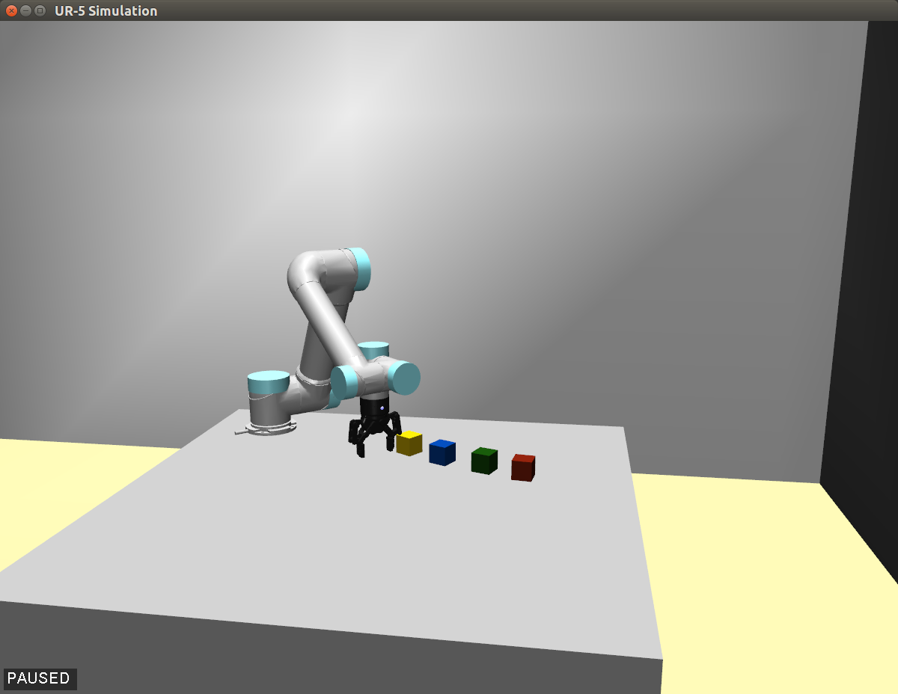
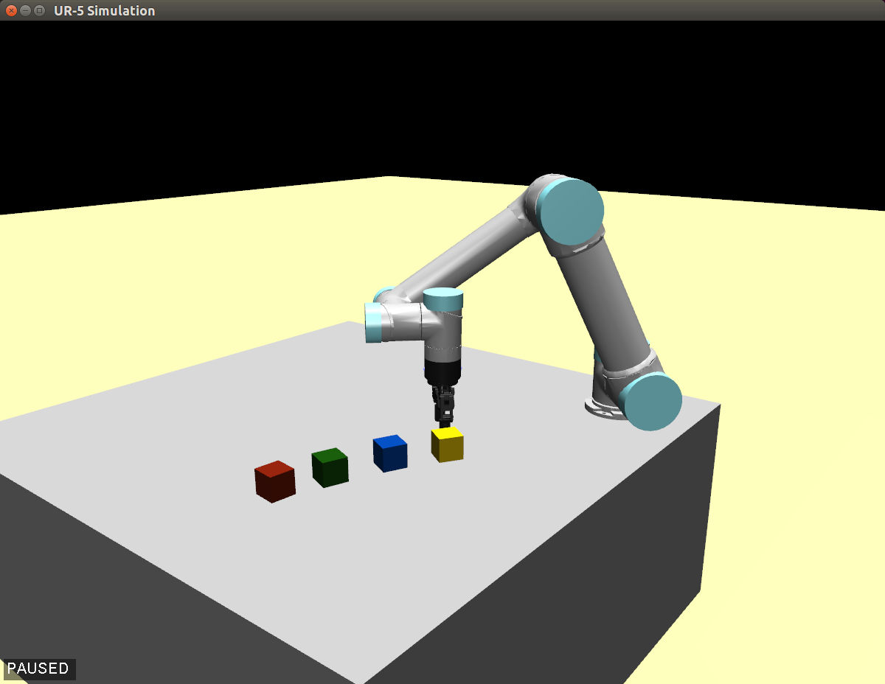

# Robotiq-UR5
Simulator of UR5 robotic arm with Roboriq gripper, built with MuJoJo

## Requirements
- [MuJoCo 1.5.0](http://www.mujoco.org/)
- [mujoco-py](https://github.com/openai/mujoco-py)

## Usage
- With Python3, `from environment import lab_env`
- With C++, copy [lab_env.cpp](./lab_env.cpp) into `mjpro150/sample/` and build it with
`g++ -O2 -I../include -L../bin -std=c++11 -mavx lab_env.cpp -lmujoco150 -lGL -lglew ../bin/libglfw.so.3 -o ../bin/lab_env`

## Demos
<figure class="half">
    
    
</figure>
